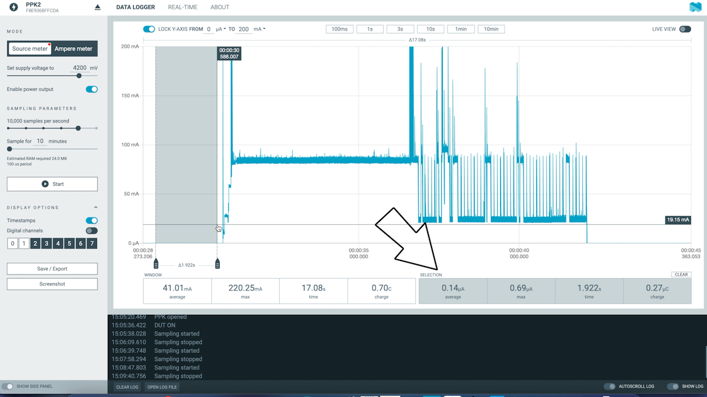

# Paperclick

Paperclick is a simple device which combines a [Picoclick-C3T](https://github.com/makermoekoe/Picoclick-C3) with the smallest EPaper display I found in the internet: [a 1.02" 128x80 pixels EPD](https://www.waveshare.com/wiki/1.02inch_e-paper_Module). The initial task was to create a simple activity tracker which updates the EPaper display with the current date and time once the display is pressed (actually it is not the display sensing the press, it's a button behind the display). The device gets the time from an NTP server over WiFi. Additionally the device can update an online service with the date/time the Paperclick was pressed.

Paperclick is based on the single core ESP32-C3 processor which is used in the Picoclick C3T as well. Furthermore it comes with an optimized battery monitoring which brings the complete device down to around 200nA current consumption in idle state.

## Features

- ESP32-C3 MCU with chip antenna
- 1.02" 128x80 pixel Epaper display
- Onboard battery charger
- Optimized battery capacity estimation
- Simple One-Button user interface (Two optional buttons available)
- WS2812 user LED
- LiPo battery charger with indicator LED

The [Youtube video (todo)](https://www.youtube.com/watch?v=t-50w3RsUlg) shows the assembly and soldering process, explains how the battery monitoring works and shows this little thing in action.


## Battery monitoring

</a>

Till now I have estimated the battery capacity with a simple voltage divider between VBAT and GND and an analog input of the MCU to read the voltage. This will draw current all the time, even if the device is not activated.

```
I = V / R = 4V / (1MΩ + 250kΩ) = 3,2µA
I = V / R = 4V / (250kΩ + 250kΩ) = 8µA
```

In order to save these few µA of current, I searched for other solution which lead me to [this](https://jeelabs.org/2013/05/18/zero-power-measurement-part-2/index.html#comments) article by Jean-Claude Wippler, where he additionally used a mosfet, a resistor and a capacitor to create something like a one-shot trigger for the voltage divider.

After some test with a Picoclick and my scope, that solution seems to be a very cool and interesting one. Paperclick is the first board where I tried this circuit, that's why there are so many measurement test points.

## Power consumption

</a>

- 82mA in average while WiFi connecting/transmitting and updating the ePaper display
- 38mA in average with WiFi disabled and updating the ePaper display
- 140nA in average in idle state

## Assembled devive
